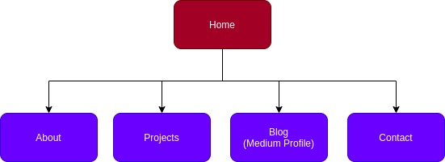

# Portfolio Site

This is the Git Repository for my Portfolio website. The current site is an interim design based on an assignment at [Coder Academy](https://coderacademy.edu.au/). I will be updating the design of this soon.

## Git Repository

[https://github.com/theandrewfulton/portfolio-site](https://github.com/theandrewfulton/portfolio-site)

## Link to Portfolio

The published portfolio site can be found [here](https://theandrewfulton.com).

## Purpose

The purpose of this portfolio site is to showcase my skills, projects, work history, and to a certain degree my personality to potential employers, collaborators and clients. It needs to do this in a functional, well laid out, clear and concise manner.

## Target Audience

The target audience for this portfolio site are recruiters and potential employers, clients and collaborators who may be interested in engaging me professionally in some form.

A second target audience are my friends, family and colleagues who are interested in following my journey training as a web developer.

## Functionality and Features

This site features responsive design sections and elements that adjust based on the size of the user's screen. This is particularly noticeable in the different menu layouts for phones, tablets and computers. It is also designed to be more easily accessible to visitors with screen readers, featuring semantic HTML throughout. Site security has also been considered, with Sub-resource Integrity implemented for resources throughout the site.

An important note here is that Google Fonts were used for font styling throughout the portfolio site. The issue of this service not supporting SRI is well documented. In the case of this site, the fonts are imported into the stylesheet, rather than the html documents directly.

The portfolio site contains a link to my Resume as a pdf on the About page and also features Projects and Blog pages, enabling me to showcase my achievements, knowledge and experience in the future, beyond just my Resume.

## Tech Stack

The portfolio is written in HTML5, with styling in SASS, which is then transpiled into CSS. Changes to the source code (along with this documentation) were tracked using Git and hosted on GitHub, with commits to the _main_ branch automatically deployed to the live site hosted on Netlify.

## Project Management

Planning this project took place Trello. You can view the Trello Board for the portfolio site [here](https://trello.com/b/llUT3AXU/portfolio-site).

## Sitemap

## More Information

For more information on how this site was designed and built, please see the original assignment repository: https://github.com/theandrewfulton/assignment-portfolio-site

